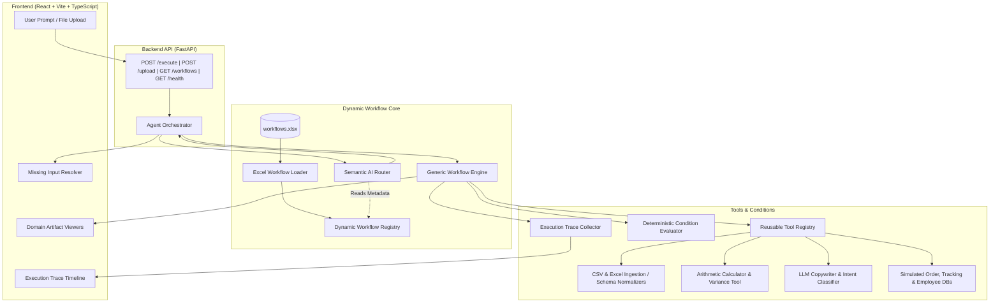

# AI Agent Workflow Automation Platform

A reusable, production-grade AI workflow automation system that reads workflow definitions from an Excel spreadsheet, semantically routes user intents, executes multi-step operational workflows through a generic engine and reusable tools, evaluates deterministic conditions, and renders live execution traces and domain artifacts via an interactive React web dashboard.

---

## 📌 Problem Statement

Modern enterprise operations require handling dozens of diverse workflows spanning inventory management, catalog auditing, price validations, employee assignments, and reporting. 

A naive engineering approach creates 10 separate chatbots or hard-coded Python scripts with duplicated logic:
- **High Maintenance Overhead**: Every business rule change requires updating code in multiple files.
- **Brittle Architecture**: Adding an 11th workflow requires building another dedicated agent from scratch.
- **Hard-Coded Dispatching**: Giant `if workflow_id == "WF001": ... elif workflow_id == "WF002": ...` chains that fail to scale.

---

## 💡 Solution

This platform treats **workflows as data-driven definitions** and implements a **single, reusable execution architecture**:

1. **Excel as Source of Truth**: All 10 workflows are defined in `data/workflows.xlsx` and parsed into memory **once** on server startup.
2. **Two-Stage Dual-Check Routing**:
   - **1st Check (Vector Search):** Dense TF-IDF vector cosine similarity retrieves the **Top 10 candidate workflows** in `0.06ms` and computes the **MRR (Mean Reciprocal Rank)** quality score.
   - **2nd Check (Gemini LLM):** Evaluates the Top 10 candidate metadata, eliminates ambiguities, extracts input parameters, and calculates a confidence score.
3. **Generic Workflow Engine**: Steps are executed dynamically by resolving required tools and condition rules from the workflow metadata without hardcoded chatbot classes.
4. **Reusable Tool Registry**: 12 modular tools (file ingestion, schema normalizers, validators, arithmetic calculators, similarity scorers, simulated APIs, and LLM generators) shared across all workflows.
5. **Deterministic Decision Rules**: Business rules (e.g. `current_stock < minimum_stock`, `price_difference > 10%`, candidate skill overlap ranking) are evaluated with predictable Python logic rather than relying on LLM arithmetic.
6. **Transparent Execution Trace**: Emits step-by-step event records (`step_started`, `tool_called`, `condition_evaluated`, `step_completed`, `error`) with millisecond timestamps for full auditability.
7. **Interactive React Dashboard**: Natural language prompt input, multipart file upload, interactive missing-input resolver, live execution timeline, and tailored domain artifact viewers.

📄 **Detailed Design Rationale & Scaling Architecture**: See [DECISIONS.md](file:///k:/Work/Assignment%20for%20job/webvory/DECISIONS.md) for Architecture Decision Records (ADRs), startup lifecycle details, and Two-Stage Dual-Check benchmarks.

---

## 🏛 System Architecture



---

## ⚡ Reusability & Scalability (The WF011 Proof)

The core strength of this architecture is complete decoupling of **workflow definition** from **workflow execution**:

$$\text{10 Workflows} = \text{10 Spreadsheet Definitions} + \text{1 Generic Engine} + \text{Reusable Tool Registry}$$

### Adding an 11th Workflow (e.g. WF011)
To add a new workflow to the system:
1. Add a new row to `data/workflows.xlsx` defining the trigger, inputs, steps, decision rule, tools, and expected output.
2. Restart or reload the backend registry.
3. **The system immediately supports WF011**:
   - The AI Router automatically discovers it in its dynamic schema.
   - The generic `WorkflowEngine` executes its steps.
   - The React sidebar and catalog explorer immediately render it.
   - **Zero modifications** are needed in the core engine, router, or frontend UI components.

*This scalability is proven via the automated test [`backend/tests/test_scalability.py`](backend/tests/test_scalability.py).*

---

## 📋 The 10 Supported Workflows

| ID | Workflow Name | Natural Language Trigger | Key Reusable Tools | Deterministic Condition / Decision | Final Output Artifact |
|---|---|---|---|---|---|
| **WF001** | **Inventory Restock Check** | *"Which products need restocking?"* | `csv_reader`, `calculator` | `current_stock < minimum_stock` | Restock report with reorder quantities |
| **WF002** | **Product Price Validation** | *"Compare internal prices with vendor prices"* | `csv_reader`, `calculator` | Flag if `abs(vendor - internal) / internal > 10%` | Price variance report highlighting exceptions |
| **WF003** | **Vendor File Processing** | *"Clean and validate this vendor spreadsheet"* | `csv_reader`, `column_normalizer`, `data_validator` | Rows missing SKU or Product Name are invalid | Normalized dataset & invalid rows report |
| **WF004** | **Product Description Generator** | *"Write SEO-friendly copy for this product"* | `llm_generate` | Explicitly flag missing attributes; do not hallucinate | SEO title, meta description, bullet points |
| **WF005** | **Customer Order Status** | *"Where is my order ORD-9021?"* | `order_lookup`, `shipment_lookup` | Match order ID / email; retrieve tracking & carrier | Real-time shipment status & carrier tracking |
| **WF006** | **Duplicate Product Detection** | *"Find duplicate products in catalog"* | `csv_reader`, `duplicate_product_detector` | Exact SKU = 100% Definite; Token similarity $\ge 0.50$ = Possible | Duplicate groups with similarity confidence |
| **WF007** | **Marketing Campaign Brief** | *"Create a campaign brief for Spring Sale"* | `llm_generate` | Goal and dates are mandatory; prompt user if missing | Comprehensive campaign brief & launch checklist |
| **WF008** | **SEO Keyword Classification** | *"Classify SEO keywords by search intent"* | `csv_reader`, `llm_generate` | Deduplicate and classify into 4 search intents | Intent breakdown (Informational, Commercial, etc.) |
| **WF009** | **Employee Task Assignment** | *"Which employee should handle this task?"* | `csv_reader`, `ranking_tool` | Score: 65% skills + 35% capacity. Escalate if score < 25 | Assigned employee recommendation & score breakdown |
| **WF010** | **Workflow Performance Report** | *"Analyze workflow performance logs"* | `csv_reader`, `reporting_tool` | Flag workflows with `failure_rate > 10%` or latency > 3.0s | SLA performance report & recommendations |

---

## 🧰 Reusable Tool Registry

All backend actions run through the unified [`ToolRegistry`](backend/app/tools/registry.py):

| Tool Name | Class | Capabilities |
|---|---|---|
| `csv_reader` | `CSVReaderTool` | Safe CSV file loading, encoding detection, structure parsing |
| `excel_reader` | `ExcelReaderTool` | Multi-sheet Excel workbook parsing and cell extraction |
| `column_normalizer` | `ColumnNormalizerTool` | Fuzzy header matching to standard canonical keys |
| `data_validator` | `DataValidatorTool` | Row-level validation and schema constraint checking |
| `calculator` | `CalculatorTool` | Stock threshold checks, price percentage variance calculations |
| `text_similarity` | `TextSimilarityTool` | Token Jaccard and N-gram lexical similarity calculations |
| `duplicate_product_detector` | `DuplicateProductDetectorTool` | Catalog SKU matching and multi-attribute similarity grouping |
| `order_lookup` | `OrderLookupTool` | Query simulated customer order database by ID or email |
| `shipment_lookup` | `ShipmentLookupTool` | Query simulated carrier APIs (FedEx, UPS, DHL) for tracking |
| `ranking_tool` | `EmployeeRankingTool` | Weighted multi-criteria ranking (skill overlap + available hours) |
| `llm_generate` | `LLMGenerateTool` | Content generation, campaign briefs, SEO intent classification |
| `reporting_tool` | `ReportingTool` | Aggregation of execution metrics, failure rates, SLA bottleneck flags |

---

## 🛡️ Error Handling & Missing Input Resolution

1. **Ambiguous Queries**: When a query like *"Check my products"* is submitted, the AI Router recognizes multiple potential targets and returns an `AMBIGUOUS_REQUEST` error prompting the user for clarification.
2. **Missing Input Resolution**: For workflows requiring mandatory parameters (e.g. WF007 without campaign dates or WF005 without an order ID), the API returns a structured `MISSING_INPUT` response. The frontend renders an interactive resolution card enabling the user to fill in the missing fields and continue execution seamlessly.
3. **Invalid Files & Broken Records**: Nonexistent files or corrupted rows are caught gracefully, recorded with an `error` event in the `ExecutionTrace`, and returned without server crashes or unhandled stack traces.

---

## 🔍 Execution Trace Visibility

Every execution produces a real-time event trace formatted as:

```text
Request Received
  ↓
Workflow Selected: WF001 (Confidence: 98%, Reasoning: "Stock levels inquiry")
  ↓
Input Validation (Declared vs Provided)
  ↓
Step 1: Load inventory records -> Tool: csv_reader (Records loaded: 12)
  ↓
Step 2: Evaluate stock threshold -> Tool: calculator -> Condition: current_stock < minimum_stock
  ↓
Step 3: Generate restock summary -> Condition: 4 products flagged for reorder
  ↓
Workflow Completed (Total duration: 4.82ms)
```

---

## 💻 Tech Stack

### Backend
- **Python 3.10+**
- **FastAPI**: Asynchronous REST API framework
- **Pydantic v2**: Strict data validation & schema contracts
- **Pandas & OpenPyXL**: Excel spreadsheet and CSV dataset parsing
- **LLM Abstraction**: Google Gemini, OpenAI, and built-in offline Semantic Engine provider
- **Pytest & Starlette TestClient**: Comprehensive automated testing suite

### Frontend
- **React 18** + **TypeScript**
- **Vite**: Ultra-fast build tool and dev server
- **Tailwind CSS**: Dark modern operations dashboard styling
- **Lucide React**: Clean iconography

---

## 🚀 Setup & Execution Guide

### 1. Prerequisites
- **Python 3.10+**
- **Node.js 18+** & **npm**

### 2. Backend Setup
```bash
# Clone the repository
git clone <repo-url>
cd webvory

# Install Python dependencies
pip install -r backend/requirements.txt

# Start the backend server
python -m uvicorn backend.app.main:app --host 0.0.0.0 --port 8000 --reload
```
- API Base URL: `http://localhost:8000`
- Interactive OpenAPI Docs: `http://localhost:8000/docs`
- Health Check: `http://localhost:8000/health`

### 3. Frontend Setup
```bash
# In a new terminal tab:
cd frontend

# Install dependencies
npm install

# Start Vite development server
npm run dev
```
- Web Dashboard: `http://localhost:5173`

---

## ⚙️ Environment Variables

### Backend (`backend/.env` / `backend/.env.example`)
| Variable | Description | Default |
|---|---|---|
| `ENVIRONMENT` | Runtime environment (`development` / `production`) | `development` |
| `DEBUG` | Enable debug log output | `True` |
| `PORT` | API listen port | `8000` |
| `WORKFLOW_EXCEL_PATH` | Path to Excel workflow definitions | `../data/workflows.xlsx` |
| `LLM_PROVIDER` | LLM service (`gemini`, `openai`, or empty for offline SemanticEngine) | `""` |
| `LLM_API_KEY` | API Key for Gemini or OpenAI | `""` |
| `MODEL_NAME` | Model identifier | `gemini-1.5-flash` |

### Frontend (`frontend/.env` / `frontend/.env.example`)
| Variable | Description | Default |
|---|---|---|
| `VITE_API_BASE_URL` | Base URL of backend FastAPI service | `http://localhost:8000` |

---

## 🧪 Automated Testing

### Backend Test Suite (91 Tests)
```bash
pytest -v
```
Verifies:
- Excel loader, schema validation, and parser logic
- Dynamic registry operations
- AI Router semantic matching and 20+ natural language paraphrases
- Ambiguous request handling and missing input detection
- Deterministic conditions (thresholds, variance, duplicates, rankings, SLAs)
- Generic execution engine step dispatch
- Scalability test (`WF011`)

### Frontend Build Validation
```bash
cd frontend
npm run build
```
Executes TypeScript type-check and produces optimized production bundle (`dist/`) with 0 errors.

---

## 🎬 Loom Video Demonstration Script & Guide

*Target Video Duration: 6 to 8 minutes*

### 1. Introduction (0:00 – 0:30)
- *"Hello! Today I am presenting the AI Agent Workflow Automation platform built for the Webvory technical assignment."*
- *"The objective is building a scalable system where workflow definitions come dynamically from an Excel file, routed by an AI agent, and executed by a generic workflow engine."*

### 2. Architecture & Design Decisions (0:30 – 1:30)
- Show the architecture diagram in the README.
- Explain the key architectural decision: **Separating workflow definitions from workflow execution**.
- Point out why this is NOT 10 separate hardcoded chatbots, but a single generic engine with reusable tools.

### 3. Excel Source of Truth (1:30 – 2:15)
- Open `data/workflows.xlsx`.
- Show several workflow rows (triggers, inputs, steps, decisions, tools, outputs).
- Show the backend startup logs demonstrating that all 10 workflows are loaded dynamically.

### 4. Live Workflow Demonstrations (2:15 – 5:00)
- **WF001 (Inventory Restock)**: Type *"Which products need restocking?"* -> Show AI Router confidence (98%), tool execution (`csv_reader`, `calculator`), deterministic condition evaluation, and restock table.
- **WF005 (Order Status)**: Type *"Where is order ORD-9021?"* -> Show simulated order and carrier tracking lookup.
- **WF003 (Vendor File Processing)**: Upload `sample_data/vendor_products.csv` -> Show column normalization and invalid row identification.
- **WF006 (Duplicate Product Detection)**: Type *"Find duplicates in product catalog"* -> Show exact SKU matches vs token similarity matches.
- **WF009 (Employee Assignment)**: Type *"Who is best suited to build a Python FastAPI ETL pipeline?"* -> Show 65% skill + 35% capacity ranking score.

### 5. Error Handling & Missing Inputs (5:00 – 6:00)
- Type *"Create a marketing campaign"* without dates or goal.
- Show how the system returns `MISSING_INPUT` and the frontend renders the interactive `MissingInputResolver` allowing the user to provide the missing fields and proceed.

### 6. Scalability & Conclusion (6:00 – 7:00)
- Highlight `backend/tests/test_scalability.py` demonstrating how `WF011` was added and executed through the exact same engine with **zero code modifications**.
- Conclude: *"By building a data-driven workflow engine with reusable tools and deterministic decision rules, the system is fully extensible for any future enterprise workflow."*
